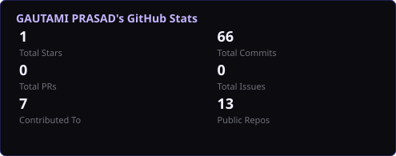
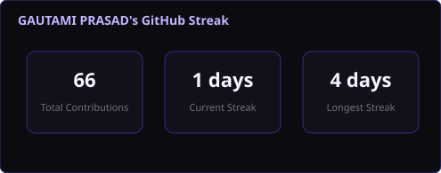
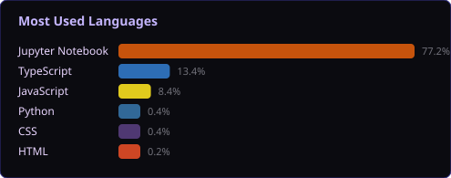
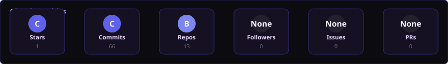
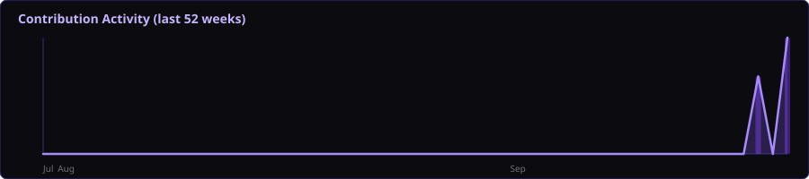

<div align="center">


<a href="https://readme-typing-svg.demolab.com">

</a>

<br/>

<a href="https://www.giet.edu/">

</a>

<a href="https://www.freecodecamp.org/">

</a>

<a href="https://www.google.com/maps/search/?api=1&query=Indore%2C%20Madhya%20Pradesh%2C%20India">

</a>

<br/><br/>

<a href="https://github.com/Gautami60">

</a>

<a href="https://www.linkedin.com/">

</a>

<a href="mailto:gautamiprasad17@gmail.com">

</a>

<a href="https://github.com/Gautami60">

</a>

<br/><br/>


</div>

---

## About

I am a **Computer Science Engineering student specializing in Data Science**, focused on building a strong foundation across **software engineering, artificial intelligence, machine learning, and full-stack product development**.

My approach is engineering-first: understand the problem, design the system, build the core logic, integrate intelligent components, optimize the implementation, and turn the result into a usable product.

I am particularly interested in:

- **Software Engineering** — clean architecture, scalable systems, APIs, algorithms, testing, Git workflows, and production-oriented development.
- **AI / ML Engineering** — machine learning pipelines, deep learning, model experimentation, evaluation, inference, and deployment.
- **Full-Stack Development** — modern frontend systems, backend APIs, databases, authentication, and end-to-end application architecture.
- **Product Engineering** — connecting engineering decisions to user needs, performance, maintainability, reliability, and measurable outcomes.

### Open To

**AI/ML Engineering • Software Engineering • Full-Stack Engineering • Research-Oriented Projects • Open Source • Technical Collaborations**

---

## Tech Stack

### Languages

<p align="center">

</p>

### Frontend

<p align="center">

</p>

### Backend & Databases

<p align="center">

</p>

### Cloud, DevOps & Tooling

<p align="center">

</p>

---

## AI / ML Expertise

| Domain | Proficiency | Details |
|:---|:---:|:---|
| Machine Learning | Developing | Supervised learning, preprocessing, feature engineering, model evaluation, experimentation |
| Deep Learning | Developing | Neural networks, computer vision concepts, sequence modeling, model experimentation |
| Data Science | Developing | Data cleaning, exploratory analysis, visualization, statistical reasoning |
| NLP | Developing | Text preprocessing, embeddings, classification, information extraction concepts |
| Computer Vision | Developing | Image processing, classification, object detection concepts |
| Model Deployment | Developing | API-based inference, model serving concepts, application integration |
| AI Product Engineering | Developing | Connecting models to real user-facing workflows and full-stack applications |

---

## Featured Projects

<details>
<summary><strong>AI-Powered Cyclone Detection & Prediction Platform</strong></summary>

A research-oriented AI/ML platform focused on **early tropical cyclone identification, classification, and predictive intelligence** using historical meteorological and satellite-derived data.

| Attribute | Details |
|:---|:---|
| **Stack** | Python • Pandas • NumPy • Scikit-learn • Deep Learning • FastAPI • React |
| **Scale** | Historical multi-year cyclone and meteorological datasets |
| **Performance** | Designed around model evaluation, inference efficiency, and reproducible experimentation |
| **Security** | API validation • Input sanitization • Controlled model access |
| **Impact** | Earlier decision support for disaster preparedness and risk analysis |
| **Repository** | [View Repository](https://github.com/Gautami60) |

### Engineering Scope

- Historical cyclone data ingestion and preprocessing.
- Exploratory analysis and feature engineering.
- ML/DL experimentation for classification and prediction.
- Evaluation using appropriate validation metrics.
- Model-to-API integration.
- Frontend visualization of predictions and supporting information.
- Architecture designed for future expansion into real-time data pipelines.

</details>

<details>
<summary><strong>Smart Full-Stack AI Application</strong></summary>

A full-stack application demonstrating the integration of **machine learning inference with a production-style web architecture**.

| Attribute | Details |
|:---|:---|
| **Stack** | Python • FastAPI • React / Next.js • PostgreSQL • REST API |
| **Scale** | Modular application architecture with separable ML and application layers |
| **Performance** | Optimized request flow, model inference paths, and frontend rendering |
| **Security** | Input validation • API boundary controls • Authentication-ready architecture |
| **Impact** | Demonstrates practical deployment of AI models inside usable software products |
| **Repository** | [View Repository](https://github.com/Gautami60) |

### Engineering Scope

- Machine learning model development and evaluation.
- RESTful inference endpoint design.
- Frontend-to-model integration.
- Database-backed application workflows.
- Separation of presentation, business logic, and inference layers.
- Deployment-oriented application structure.

</details>

<details>
<summary><strong>Performance-Optimized Interactive Web Experience</strong></summary>

A cinematic interactive web application engineered around **responsive UI, animation performance, asset optimization, and mobile-first delivery**.

| Attribute | Details |
|:---|:---|
| **Stack** | Next.js • React • TypeScript • CSS • Vercel |
| **Scale** | Rich interactive interface with animation-heavy components and media assets |
| **Performance** | Rendering optimization • Animation throttling • Image optimization • Reduced main-thread work |
| **Security** | Client-side access controls • Controlled content flows |
| **Impact** | Demonstrates the ability to balance visual quality with runtime performance |
| **Repository** | [View Repository](https://github.com/Gautami60) |

### Engineering Scope

- Responsive UI architecture.
- Interactive animated sections.
- Performance profiling and bottleneck analysis.
- Asset and image optimization strategies.
- Efficient rendering for mobile and desktop environments.
- Deployment and production debugging.

</details>

---

## Experience

### Software / AI Engineering Projects

**Independent Engineering Work**  
**2025 — Present**

Designing and building academic, experimental, and product-oriented software systems across AI/ML and full-stack engineering.

#### Scope of Work

- Translate ambiguous problem statements into technical architectures.
- Develop data-processing and machine-learning workflows.
- Build web applications and backend APIs.
- Integrate ML models into end-user software systems.
- Perform debugging, optimization, and performance analysis.
- Evaluate technical feasibility and identify implementation gaps.
- Use Git-based workflows for source control and iteration.

**Skills:** `Python` `Machine Learning` `Deep Learning` `React` `Next.js` `FastAPI` `SQL` `Git` `Linux`

---

## Achievements

<div align="center">

| Recognition | Details |
|:---|:---|
| **Problem Solving** | Consistent focus on analytical thinking, implementation, debugging, and technical experimentation |
| **AI / ML Development** | Hands-on exploration of end-to-end ML workflows from data preparation to application integration |
| **Product Engineering** | Built projects with attention to UX, architecture, deployment, responsiveness, and performance |
| **Competitive Project Development** | Experience evaluating technical novelty, feasibility, scalability, and real-world impact |
| **Continuous Learning** | Actively building breadth across software engineering, AI/ML, systems, and full-stack development |

</div>

---

## Certifications

### AWS

<p>
<a href="https://aws.amazon.com/certification/">

</a>
</p>

### Oracle

<p>
<a href="https://education.oracle.com/">

</a>
</p>

### NPTEL

<p>
<a href="https://nptel.ac.in/">

</a>
</p>

### Cisco

<p>
<a href="https://www.cisco.com/site/us/en/learn/training-certifications/certifications/index.html">

</a>
</p>

---

## Coding Profiles

<div align="center">

<a href="https://leetcode.com/">

</a>

<a href="https://www.geeksforgeeks.org/">

</a>

<a href="https://www.hackerrank.com/">

</a>

<a href="https://www.codechef.com/">

</a>

</div>

---

## GitHub Analytics

<div align="center">

<a href="https://github.com/Gautami60">

</a>

<a href="https://github.com/Gautami60">

</a>

<br/><br/>

<a href="https://github.com/Gautami60">

</a>

</div>

---

## GitHub Trophies

<div align="center">



</div>

---

## Contribution Activity

<div align="center">



</div>

---

## Contribution Snake

<div align="center">

<picture>
  <source
    media="(prefers-color-scheme: dark)"
    srcset="./profile/github-contribution-grid-snake-dark.svg"
  />

  <source
    media="(prefers-color-scheme: light)"
    srcset="./profile/github-contribution-grid-snake.svg"
  />

  
</picture>

</div>

---

## Current Focus

```yaml
learning:
  - Python
  - Data Structures and Algorithms
  - Machine Learning
  - Deep Learning
  - SQL
  - Linux
  - System Design Fundamentals

building:
  - AI/ML Projects
  - Full-Stack Applications
  - Production-Oriented APIs
  - Data-Driven Products

exploring:
  - MLOps
  - Computer Vision
  - Applied Generative AI
  - Cloud Engineering
  - Scalable Software Architecture

open_to:
  - AI/ML Collaborations
  - Software Engineering Projects
  - Open Source
  - Research-Oriented Work
  - Product Engineering Opportunities
